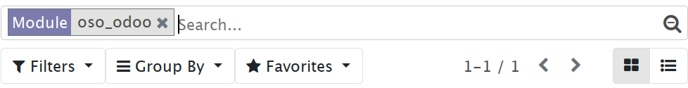

# oso_odoo

oso support for Odoo

## Installation

`cd` into your Odoo addons directory of choice and clone this repository into a
directory named `oso_odoo`, e.g.:

```console
$ cd odoo/addons
$ git clone https://github.com/osohq/oso_odoo.git
```

Next, we need to install the module's dependencies:

```console
$ cd oso_odoo
$ pip install -r requirements.txt
```

The module should now be in your Odoo addons path. To install the module
through the Odoo web interface, search for "oso_odoo" on the "Apps" page,
making sure to clear the "Apps" filter:



Click "install" on the "oso_odoo" tile.

You can also install the module on the command line using `odoo-bin`:

```console
$ odoo-bin -i oso_odoo -d <database>
```
